# Bimtama Admin

Websites for managing final assignment guidance include:

- [x] Associate's degree
- [x] Bachelor's Degree

## Tech Stack

**Client:** NextJS, Ant Design, TailwindCSS

**Server:** Node, KoaJS

## Installation

1. `npm install`
2. `cp .env.example .env`
3. `npm run dev`
4. Access server development at `localhost:3000`

## Module

This website consists of several modules, among others :

1. Setting
2. Admin
3. Mahasiswa
4. Dosen

## Features

### Setting

- [x] Management User
- [x] Management User Group
- [x] Management Modul
- [x] Management Menu
- [x] Management Access Modul
- [x] Management Access Menu
- [x] Management Master Category
- [x] Management Master Data
- [x] Parameter

### Admin

- [ ] Dashboard (Coming soon)
- [x] Outline Component

### Mahasiswa

- [ ] Dashboard (Comming soon)
- [x] Kelompok
- [x] Jadwal Pertemuan
  - [x] Kelompok
  - [x] Personal
- [x] Bimbingan
- [x] Pembimbing
- [x] Setting
  - [x] Outline
  - [x] Profile

### Dosen

- [ ] Dashboard (Comming soon)
- [x] Kelompok
- [x] Jadwal Pertemuan
  - [x] Kelompok
  - [x] Personal
- [x] Bimbingan
- [x] Setting
    - [x] Kelompok Saya
    - [x] Profile

## Flow Application

### Point Of View Admin

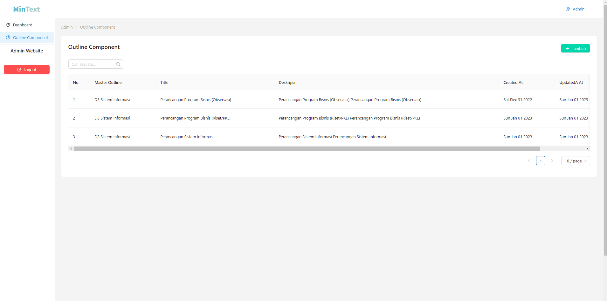

The User Group Admin is responsible for creating a master outline along with the final project components based on the level of education and the student's major. Example : 

A. D3 Sistem Informasi - Perancangan Program Bisnis (Observasi)	
  1. Proposal Judul
  2. BAB I - Pendahuluan
  3. BAB II - Landasan Teori
  4. BAB III - Pembahasan
  5. BAB IV - Penutup

### Point Of View Mahasiswa

### 1.Kelompok

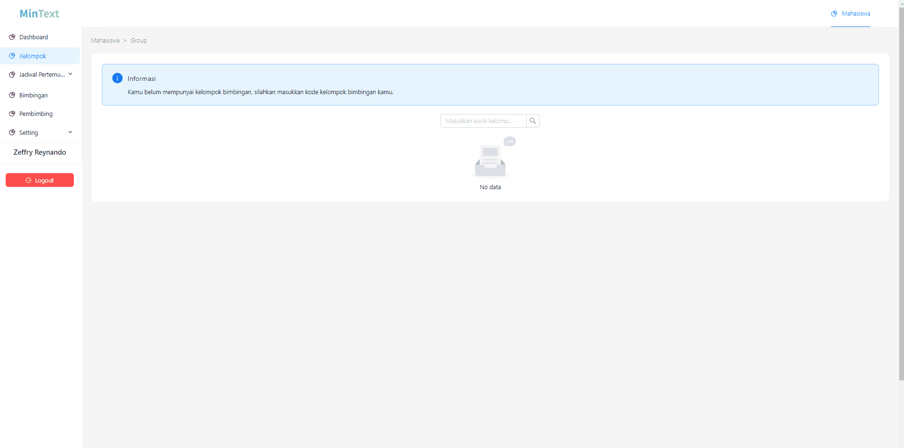

In this menu, students can search for guidance groups by typing the guidance group code. Students can also leave the group if there is an error.

Students can only enter into one guidance group only.

### 2.Jadwal Pertemuan Kelompok / Personal

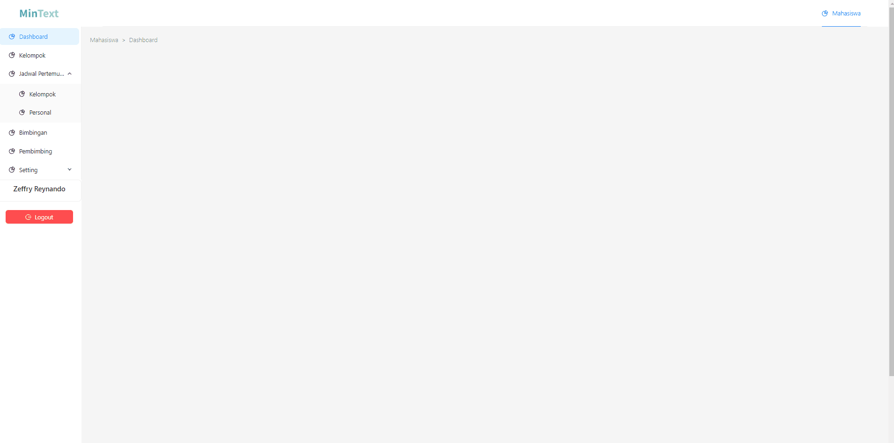

In this menu, students can see an announcement when the guidance will be carried out. In addition to group meetings, students can also see personal meeting announcements if the lecturer personally wants to have a private meeting.

### 3.Bimbingan

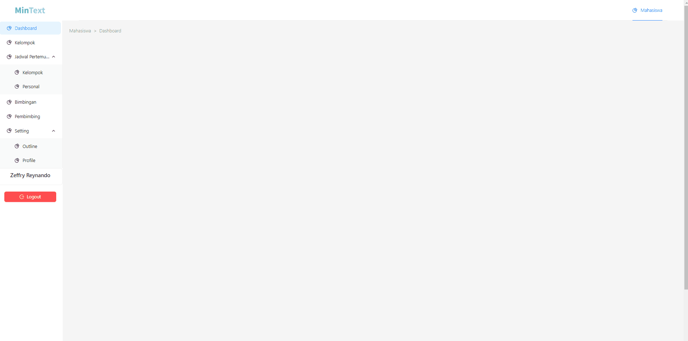

On this menu, before starting student guidance, you are required to have chosen the right outline.

After entering the guidance menu, students are required to complete the guidance component outline according to the chosen outline one by one.

To complete the outline component, students are required to get approval from their lecturers as a sign that students have completed the outline properly.

There are status criteria in the outline component of this guidance, including:

- Approved

Student outline components are declared according to the criteria and can proceed to the next outline component.

- Rejected

The student's outline component is not appropriate and the student is required to repeat the submission of the outline component. Here students also get notes / notes from their lecturers

- Progress

The student outline component is currently under examination by the lecturer

Students cannot submit multiple submissions if the previous outline component is still in the review process or has been approved by the lecturer

### 4.Pembimbing

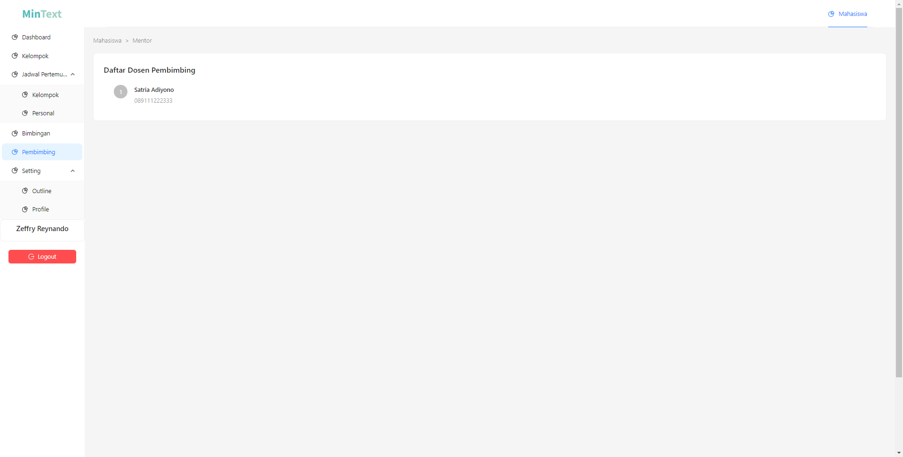

Students can view their lecturer's information

### 5.Setting - Outline

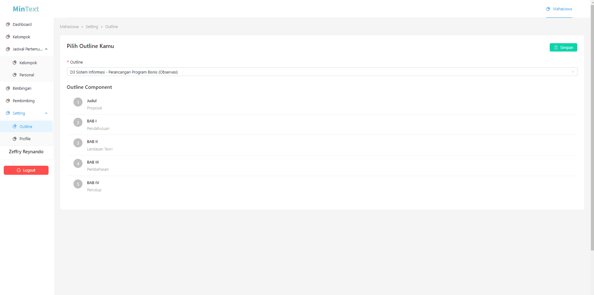

In this menu, students are required to choose an outline of their guidance, students cannot do guidance if they have not selected an outline.

However, students cannot change the outline if they are currently under guidance.

### 6.Setting - Profile

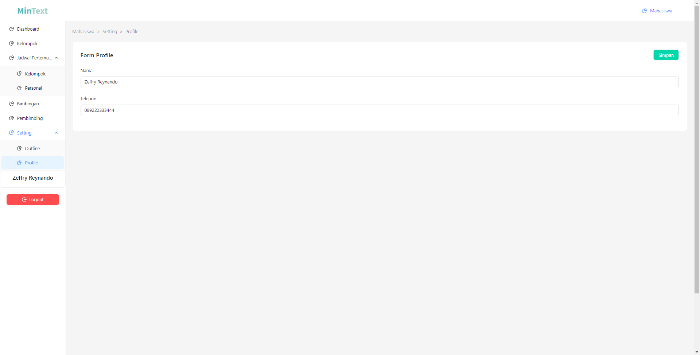

Menu to update student profiles

### Point Of View Dosen

### 1.Kelompok

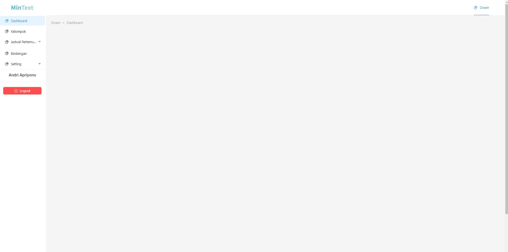

In this menu, lecturers can create guidance groups. After the success of the guidance group, the lecturer can copy the group code to be distributed to the guidance students.

Lecturers can create groups many times, but there is a rule that the last group created will be the active guidance group.

To change the active guidance group, you can go through the **Setting > Kelompok Saya**

### 2.Jadwal Pertemuan Kelompok / Personal

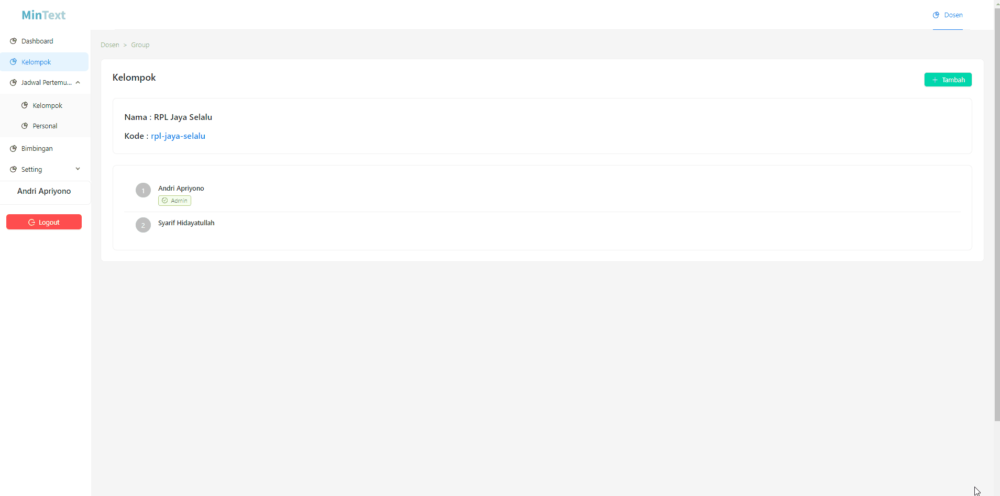

In this menu, lecturers can schedule meetings for their guided students. Besides being able to schedule meetings for all the students under his guidance, he can also schedule individual meetings.

### 3.Bimbingan

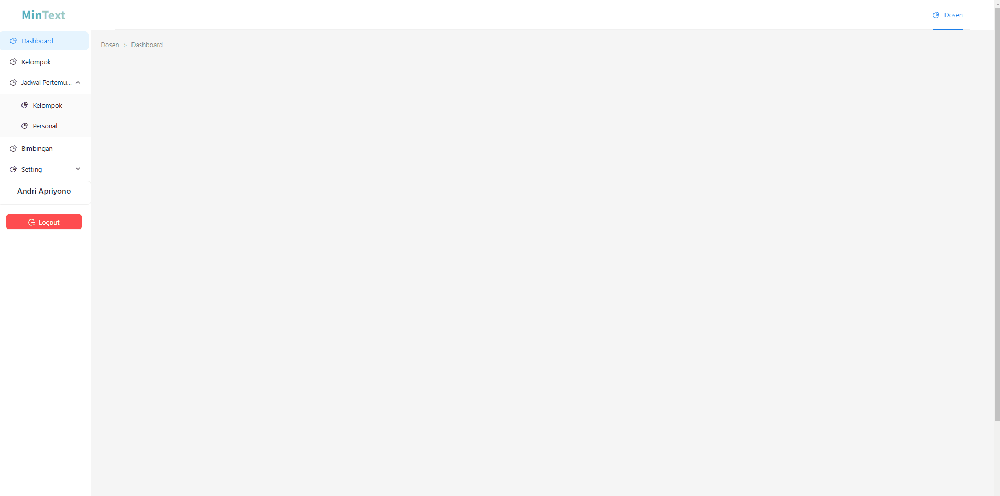

In this menu, the lecturer is responsible for checking the submission of the outline component of the student guidance. After the lecturer has finished checking the results of his student submissions, he can take several actions including:

- Approved

Declare that the student's submission is appropriate and can proceed to the next outline component.

- Rejected

Declare the student's submission is not appropriate. Lecturers can provide notes and supporting files to further clarify their notes

- Progress

Still in the inspection process

### 4.Setting - Profile

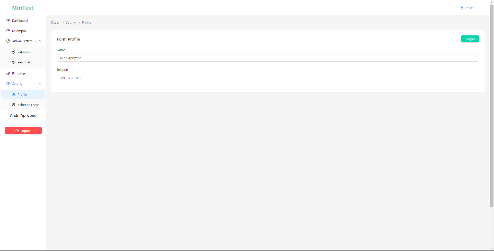

Menu for updating lecturer profiles.

### 5.Setting - Kelompok Saya

Menu to change the active group of lecturers. Changes to this group will affect student data that appears on the menu:

- Groups
- Schedule of Group & Personal Meetings
- Guidance

## Related

Here are some related projects

[Bimtama API](https://github.com/zgramming/Bimtama-API)

## Feedback

If you have any feedback, please reach out to us at zeffry.reynando@gmail.com

## Authors

- [@zgramming](https://www.github.com/zgramming)
