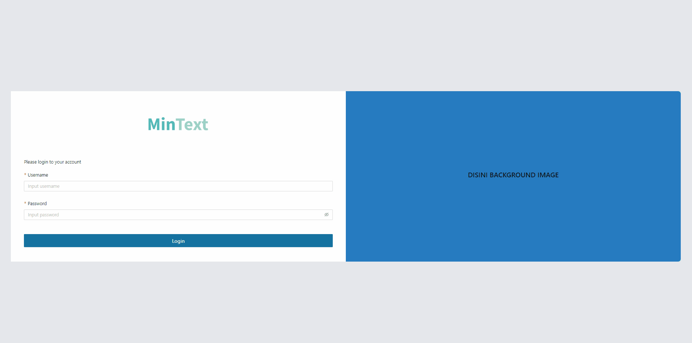
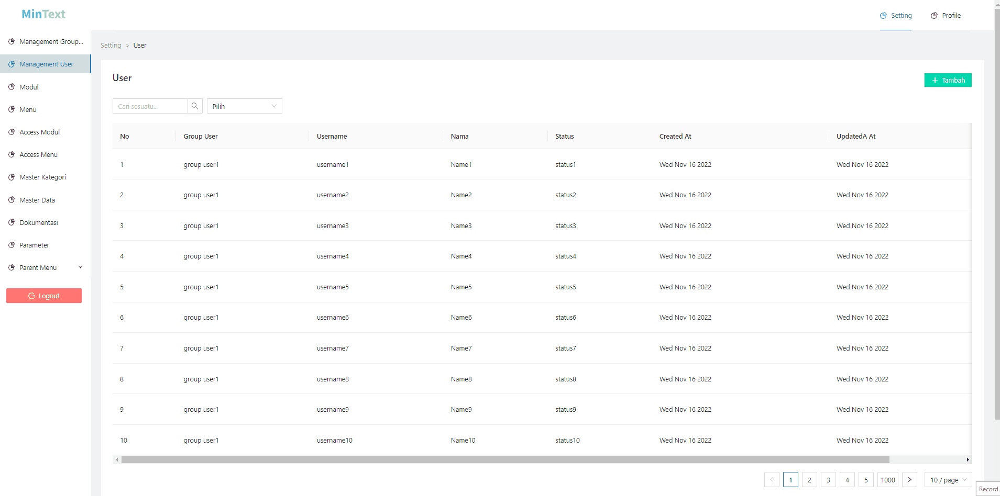

# Mintext (Admin Next JS)

Starter Template Admin Dashboard built in with stack :

1. Next JS
2. Tailwind CSS
3. Ant Design

## Installation

1. `npm install`
2. `cp .env.example .env.development` && `cp .env.example .env.production`
3. `npm run dev`
4. Access server development at `localhost:3000`

## Features

- Next JS Layouting Management
- Customize Header & Sider Menu
- Built in component based on Ant Design including : 
    - Form
    - Table

- Login Page
- Management User Page including :
    - Management User Group
    - Management User
    - Modul
    - Menu
    - Access Modul
    - Access Menu
    - Master Category
    - Master Data
    - Documentation
    - Parameter
    - Parent & Children Menu Example
- Cookie Session Management Login & Logout

## Demo

- Login Page

- Management User Menu

## Related

Here are some related projects

[Admin SeeMyCV](https://github.com/zgramming/admin.seemycv)

## Feedback

If you have any feedback, please reach out to us at zeffry.reynando@gmail.com

## Authors

- [@zgramming](https://www.github.com/zgramming)
